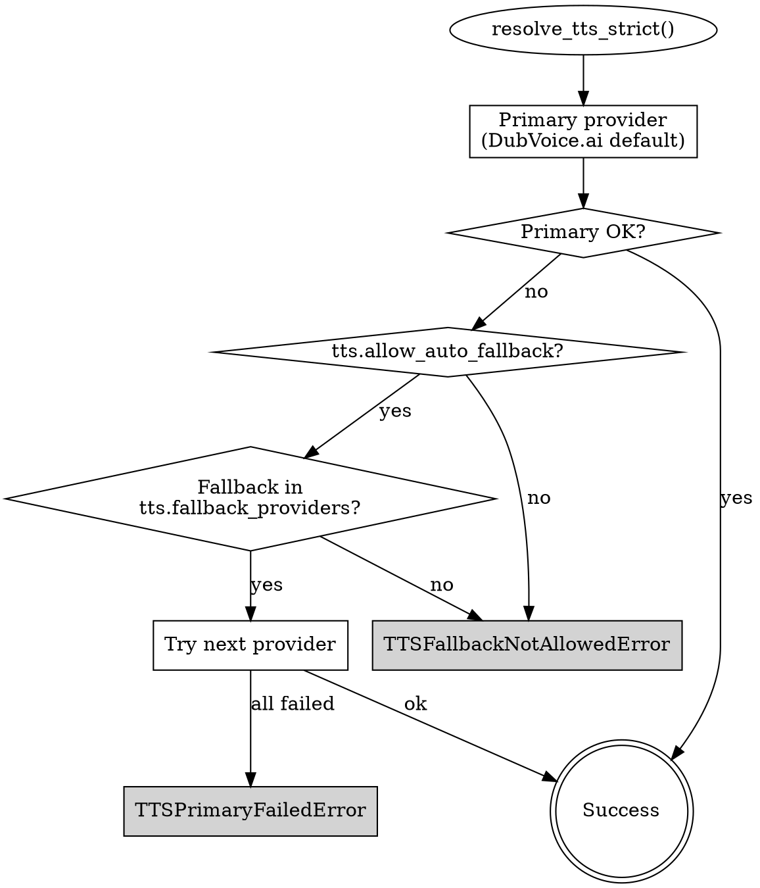

# TTS Fallback Akışı — No Auto-Fallback (Faz 2)

**Commit:** `91f49d7`

## SABIT Kural

> **Otomatik fallback YOK.** DubVoice.ai primary olarak çalışır. Birincili
> düştüğünde sistem başka bir provider'a **sessizce geçemez**. Ancak admin
> explicit olarak `tts.allow_auto_fallback=true` ayarlayıp
> `tts.fallback_providers` allowlist'ine ekleme yaptıysa, explicit state
> machine fallback denemesini yapar ve her karar audit'e yazılır.

## Akış



## Hata Sınıfları

- `TTSPrimaryFailedError` — primary başarısız ve fallback da başarısız
  (veya açıkça izin verilip de liste boş).
- `TTSFallbackNotAllowedError` — primary başarısız, `allow_auto_fallback`
  kapalı veya allowlist boş / geçersiz.
- `TTSProviderNotFoundError` — registry'de hiçbir TTS kabiliyetli provider
  yok.

## Audit Artifact

Her karar `tts_fallback_audit.json` dosyasına yazılır:

```json
{
  "requested_at": "2026-04-15T12:00:00+00:00",
  "primary_provider_id": "dubvoice",
  "primary_attempt": {"status": "failed", "error_class": "TimeoutError"},
  "auto_fallback_enabled": true,
  "fallback_providers": ["elevenlabs"],
  "fallback_attempts": [
    {"provider_id": "elevenlabs", "status": "success", "duration_ms": 3204}
  ],
  "final_provider_id": "elevenlabs",
  "final_status": "success_fallback"
}
```

## Settings (admin-only)

| Key | Tip | Default | Visibility |
|-----|-----|---------|-----------|
| `tts.allow_auto_fallback` | bool | `false` | admin-only |
| `tts.fallback_providers` | list[str] | `[]` | admin-only |

Her iki ayar SABIT olarak kullanıcı yüzeyine çıkmaz; Faz 6 testi bu kuralı
kilitler.

## Test Kapsamı

- `backend/tests/test_tts_faz2_strict_resolution.py`
- `backend/tests/test_tts_faz2_fallback_audit.py`
